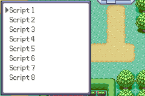

# 白金挖矿代码移植

### 注: 该项目的代码基于泄露的白金源码移植，很多函数命名都是GF的，并且保留了一些日文的注释，可能会存在乱码
### 使用前请阅读设置

## 功说明

- ***第一次挖矿时***:
    - 触发特殊文本提示
    - 不会生成铁块
    - 必定出现三件宝物

- ***宝物的稀有度***
    - 每种宝物支持四种概率设置(```_fossilRandGet```)
        - 根据玩家的`训练师id`奇偶确定概率
        - 根据玩家的是否获得了全国图鉴确定概率
    - 石板类道具的概率为1，并且在获得后不会再出现


## 设置

### 参数设置

请设置`src/ug_dig_fossil.c`文件的下列参数

```c
#define _PARTS_NUM_MAX   (8)            // 最大出现物品的数量，包含了铁块
#define _PARTS_TREASURE_NUM_MAX (4)     // 最大出现的宝物数量，原版为2到4种
#define DIG_FOSSIL_DEBUG 1              // 是否开启debug功能，开启后按住B键会隐藏掉遮挡层直接显示宝物
```

### 初次挖掘Flag

设置`include/dig_fossil.h`的`UnderGroundIsFirstFossil`和`UnderGroundSetFirstFossil`的`flag`或者根据需求改成其他的代码

```c
static inline bool8 UnderGroundIsFirstFossil(void) // 检查是否第一次挖掘
{    
    return !FlagGet(FLAG_UNUSED_0x055);
}

static inline void UnderGroundSetFirstFossil(void) // 设置第一次挖掘
{    
    FlagSet(FLAG_UNUSED_0x055);
}
```

### 石板道具的获得

设置`include/dig_fossil.h`的`FossilGetPlateBit`和`FossilSetPlateBit`的`var`或者根据需求改成其他的代码
#### 注意：这里使用了var来储存石板情况，但是var只有两字节所以只支持16个石板，如果需要添加自行修改代码

```c
// 检查石板时候已经获得
static inline u32 FossilGetPlateBit(u8 type)
{
    return VarGet(VAR_UNUSED_0x404E) & (0x0001 << (type - DIG_PARTS_PLATE_FIRE));
}

// 设置已经获取石板的flag
static inline void FossilSetPlateBit(u8 type)
{
    u32 digBit = VarGet(VAR_UNUSED_0x404E);

    digBit |= (0x0001 << (type - DIG_PARTS_PLATE_FIRE));

    VarSet(VAR_UNUSED_0x404E, digBit);
}
```

## 添加新的宝物

宝物数据位于`src/data/dig_fossil.h`的表格`gFossilGamePartsData`, 由于直接复制的dp数据所以看起来很乱，找到结尾添加新的宝物数据

宝物数据示例：
```c
{
    .attribute = NULL, // 宝物实体的范围，NULL则整个宽x高的范围都是宝物的一部分
    .random = 1,    // 训练师ID为偶数且没获得全国图鉴时的概率
    .random1 = 1,   // 训练师ID为奇数且没获得全国图鉴时的概率
    .random2 = 1,   // 训练师ID为偶数且获得全国图鉴时的概率
    .random3 = 1,   // 训练师ID为奇数且获得全国图鉴时的概率
    .width = 8,       // 宝物宽度，素材的宽/16
    .height = 8,       // 宝物高度，素材的高/16
    .partsType = DIG_PARTS_NONE, // 宝物类型，用于确定该宝物的道具Id
    .ncg = NARC_ug_parts_kaseki_midotama_s_NCGR, // 宝物的素材图片地址
    .ncl = NARC_ug_parts_kaseki_midotama_NCLR, // 宝物的素材色板地址
};
```

打开`include/dig_fossil.h`添加宝物的类型
找到下列代码，在注释的后面新增一项宝物类型
```c
#define DIG_PARTS_PLATE_DARK (58)                 // こわもてプレート
#define DIG_PARTS_PLATE_IRON (59)                 // こうてつプレート

// 新增宝物类型

#define DIG_PARTS_TREASURE_MAX (60)
```
新增后将`DIG_PARTS_TREASURE_MAX`改为你新增的最后一个编号+1

添加宝物对应的道具编号在下列表格里：
```c
static const u16 gFossilTypeToItemIndex[DIG_PARTS_TREASURE_MAX] = 
{
    // ...
    [新增的宝物类型] = 对应的道具编号,
}
```

## 玉的获取
暂时没有对挖到的玉进行处理，请在下面函数里添加代码处理

### 注意：由于玉没有新增道具，所以名字使用的0号道具，自行修改代码适配项目
```c
static bool8 _fossilGetMessage(void)
{
    int i;

    for (i = 0; i < sFossilGameData->_PARTS_TREASURE_NUM; i++)
    {
        if (sFossilGameData->aDeposit[i].bGetItem == TRUE)
        {
            u16 item = gFossilTypeToItemIndex[sFossilGameData->aDeposit[i].partsType];
            int digCarat = _calcDigStoneCarat(sFossilGameData->aDeposit[i].partsType);

            sFossilGameData->aDeposit[i].bGetItem = FALSE;
            sFossilGameData->digCarat = digCarat;
            
            if (CommDigIsStone(sFossilGameData->aDeposit[i].partsType))
            {
                StringCopy(gStringVar1, gItemsInfo[item].name);
                ConvertIntToDecimalStringN(gStringVar2, sFossilGameData->digCarat, STR_CONV_MODE_LEFT_ALIGN, 2);
                StringExpandPlaceholders(gStringVar4, gText_GetTreasure);
                // 玉的获取代码
                // 
            }
            else
            {
                StringCopy(gStringVar1, gItemsInfo[item].name);
                StringExpandPlaceholders(gStringVar4, gText_GameGetItem);
                AddBagItem(item, 1);
                UnderGroundSetFossilDig(sFossilGameData->aDeposit[i].partsType);
            }
            FossilGame_AddTextPrinterForMessage(gStringVar4);
            return TRUE;
        }
    }
    return FALSE;
}
```
`sFossilGameData->aDeposit[i].partsType`玉的类型

`sFossilGameData->digCarat`玉的尺寸